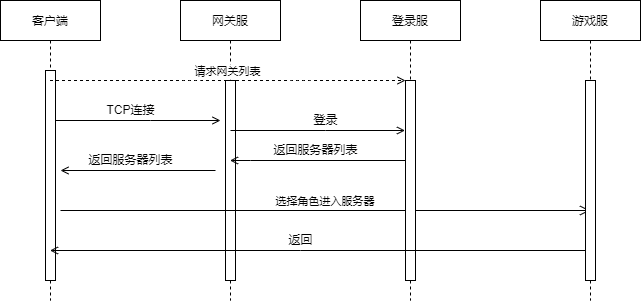

# 架构
&emsp;&emsp;服务器采用多进程进行架构，客户端到网关、内部通信使用自定义TCP进行网络通信（Netty+Protobuf），后台管理系统调用查询使用HTTP协议。整体架构如下所示


## 登录服
&emsp;&emsp;登录服可水平扩展，兼容了类似zookeeper的服务发现功能，游戏服、网关服启动时会向所有的登录服进行注册，同时可管理他们的运行状态。
主要功能如下：
* 登录校验
* 获取游戏服务器列表
* 获取网关列表
* 网关服、游戏服状态管理

&emsp;&emsp;玩家首次打开游戏APP通过通过HTTP请求网关列表，登录服返回空闲的网关地址；
APP使用返回的地址向网关进行TCP连接，然后进行登录校验，获取游戏大区列表，玩家选择登录游戏逻辑服。后续所有客户端请求TCP消息都通过网关服转发，时序图如下所示：  
  


## 网关服
&emsp;&emsp;网关服也是水平扩展的，连接登陆服、游戏逻辑服、世界服，负责各自消息的转发，主要功能如下：
* 网络消息的转发
* 玩家连接会话管理
* 消息合并
* 数据加解密
* 数据压缩、解压缩
* 玩家通信频率限制，IP黑名单处理

&emsp;&emsp;玩家登录选择游戏服后，会在网关绑定玩家登录的游戏服连接会话，以后所有消息都转发到对应该游戏服。
 网络消息转发通过为每个消息定义一个消息ID进行转发。如果消息ID是注册在游戏逻辑服，就将相应的消息转发给游戏逻辑服。  
 
 &emsp;&emsp;消息合并是将游戏逻辑服同一时间同一玩家的多条返回消息合并成一个消息转发给客户端，减少网络延迟，丢包重发等。
 消息合并不超过MTU，且必须设置超时时间。数据加解密使用对称加密算法RC4，创建Socket时服务器返回一个密钥字符串。
 数据压缩使用Snappy进行压缩，且只对消息长度超过MTU的部分数据进行压缩。
 通信频率限制，IP黑名单主要是针对非法玩家使用加速器的请求，篡改协议等做出相应的限制。
 
### 协议定义
####  用户到网关
&emsp;&emsp;用户到网关的协议格式如下，其中消息长度第30位标识是否加密，29位标识是否压缩，后二十位表示真正的消息长度。
```
消息长度[4]+消息ID[4]+Protobuf字节流
```
#### 网关和内部进程
&emsp;&emsp;网关到内部进程服务协议增加了玩家ID，需要知道每条消息归属于那个玩家。
```shell script
消息长度[4]+消息ID[4]+玩家ID[8]+Protobuf字节流
```

## 游戏服
&emsp;&emsp;一个游戏服是一个独立的游戏世界，玩家所有游戏操作相关的逻辑都在游戏服进行处理。多个游戏地图场景在一个游戏服中使用多线程处理，没有按照地图进行创建进程。
核心功能模块参考[下一节](核心模块.md)，主要功能模块有：
* 武器、宠物、镶嵌、法宝、成就、称号、境界、坐骑、翅膀、时装等养成系统
* 公会、好友、组队、邮件、聊天、师徒、结婚等社交系统
* 背包、仓库、商城、交易、摆摊等系统
* 野外场景、战场、副本等系统
* AI、寻路、技能、Buff等系统
* 活动系统
     
     
## 日志服
&emsp;&emsp;日志服也是水平扩展的，游戏服在多个可用日志服中随机选择一个进行日志传送。
日志服主要功能是将所有收到的消息批量写入MySQL数据库，供后台系统进行处理。

## 充值服
&emsp;&emsp;充值服也是水平扩展的，主要是功能是验证第三方充值的合法性。
