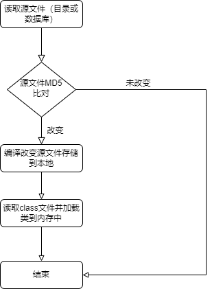

# 核心模块
&emsp;&emsp;此小节主要介绍MMORPG游戏中的关键技术、特性及注意事项，主要模块有：
* 线程模型
* 热更新
* 地图设计
* 视野管理	    
* NPC AI、寻路
* 断线重连
* 属性设计
* 排队系统

## 线程模型
&emsp;&emsp;因为服务器采用的是多进程多线程模型，因此线程模型未设计好，经常会出现各种bug和性能问题。
经过多次实践借鉴最终基于netty的线程模型进行了封装，源码可参考[javaLib](https://github.com/jzyong/javalib/tree/main/javalib-network/src/main/java/com/jzy/javalib/network/scene) 。
采用n个线程对应m个队列，一个线程可绑定多个队列，一个队列可以是一个功能模块，比如公会可分配一个队列绑定到唯一的线程，如下图所示：  


```
//场景线程组
SceneLoopGroup sceneLoopGroup = new SceneTaskLoopGroup();
//全局线程组
SceneLoopGroup soleLoopGroup = new SceneTaskLoopGroup();

//注册
SceneLoop sceneLoop = soleLoopGroup.next();

//teamScene 是实现了Scene接口的TeamManager单例对象
teamScene.register(sceneLoop);
guildScene.register(sceneLoop);
...
```
&emsp;&emsp;上面示例代码`SceneTaskLoopGroup`等价于Netty的`NioEventLoopGroup`,`Scene`等价于Netty的`Channel`。
全局所有玩家操作的对象如公会，聊天，组队等都单独创建一个独立的队列，所有玩家该功能模块的操作都丢人该队列中执行；
野外场景，副本的创建也单独创建一个队列，在同一场景、副本的玩家操作在同一队列中执行。

## 热更新
&emsp;&emsp;热更新使用Java自带的`JavaCompiler`将源文件编译成class文件，然后使用`ClassLoader`将class文件加载到内存中，
源码及示例可参考[GameServer4j](https://github.com/jzyong/GameServer4j) 。
此方法优点是使用java原生代码，开发简单方便;缺点是只能更新部分逻辑，如数据存储实体类不能进行热更新，逻辑必须实现接口。
大致流程如下：  



## 地图设计

## 视野管理
	    九宫格
## NPC AI、寻路
## 断线重连
## 属性设计
## 排队系统
