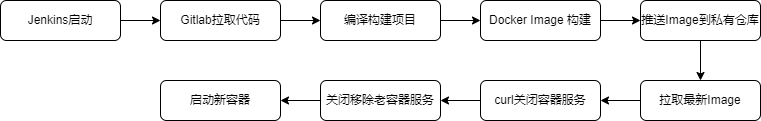

# 核心模块
&emsp;&emsp;此小节主要介绍Slots游戏中的关键技术、特性及注意事项，主要模块有：
* 线程模型
* 热更新
* CI/CD

## 线程模型
&emsp;&emsp;线程模型和[MMORPG线程模型](../MMORPG项目/核心模块.md)模型类似，源码可参考[javaLib](https://github.com/jzyong/javalib/tree/main/javalib-network/src/main/java/com/jzy/javalib/network/scene) 。
采用n个线程对应m个队列，一个线程可绑定多个队列，一个队列可以是一个功能模块，比如公会可分配一个队列绑定到唯一的线程。因为玩家操作基本无互操作，因此每个玩家都分配了一个队列，所有玩家操作都在自身队列执行，如下图所示：  

## 热更新
&emsp;&emsp;热更新方式同MMORPG项目一致，参考[MMORPG热更新](../MMORPG项目/核心模块.md)。

## CI/CD
&emsp;&emsp;因为服务器采用微服务架构，进程数上百个，因此采用Docker部署，然后结合jenkins一键部署，加快部署流程。具体搭建技术使用可参考后面的运维篇。

### 测试环境
&emsp;&emsp;测试环境运行比较简单，直接在Jenkins中运行项目，更新流程如下：  

### 生产环境
&emsp;&emsp;生产环境服务运行于Docker中，在Jenkins中启动、构建项目、镜像制作，
然后利用私有Docker Register和Docker远程命令执行一键部署。
因为服务都是有状态服务，因此不能直接杀进程，在拉取镜像后，使用后台HTTP调用关闭服务器，确保所有数据都被持久化。
具体更新流程如下：  

