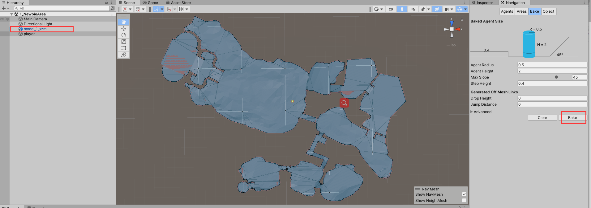

# 寻路系统
&emsp;&emsp;因为客户端使用的Unity，因此服务器寻路系统和客户端保持一致采用导航网格和A*算法实现。

## 寻路方式

多边形寻路参考`PolygonNavMesh` 原理： 
1. 将unity导出的数据生成凸多边形
2. 找出所有凸多边形共享的边
3. 使用A*算法找出起点到目标点所经过的多边形列表
4. 使用漏斗算法找出顶点坐标

## 导航网格
&emsp;&emsp;导航网格是一系列的凸多边形相连的网格，比路点拥有更少的数据存储，可方便实现分层寻路系统。

### Unity导出NavMesh

&emsp;&emsp;Unity导出NavMesh首先需在场景中烘培出寻路层NavMesh，因为服务器寻路精度要求没有客户端要求高，
因此在烘培NavMesh时并未使用关卡几何体对象进行烘培，而是美工制作了一个行走面片进行烘培，这样能有效减少导航网格的凸多边形个数，提升性能。
其次需要注意Unity是左手坐标系，服务器是基于[gdx-ai](https://github.com/libgdx/gdx-ai) 的右手坐标系，因此导出时需要将y坐标取反。
最后需要特别注意Unity生成的相邻的凸多边形顶点可能共边不共顶点，服务器创建邻接关系是需要判断是否相连。
Unity NavMesh导出工具参考[NavMeshDemo](https://github.com/jzyong/NavMeshDemo) ，具体步骤如下：  

1. 选中model_1_xzm,然后在Navigation中烘培行走层对象  
  

2. 选择工具-导出服务器NavMesh,点击测试地图大小，修改地图范围  
  

3. 点击生成NavMesh数据，将生成的json文本导入服务器[寻路工具](https://github.com/jzyong/GameAI4j) 查看  

## 总结
1. 多边形寻路和三角形寻路由于原理相同，性能消耗差不多，由于多边形合并了三角形，速度稍微快一些；顶点寻路相比于多边形寻路慢了5~40倍
2. 多边形寻路需要导出的寻路数据在行走层中没有额外的顶点，共边顶点坐标需要一致，顶点寻路由于由于采用阻挡区三角形顶点寻路，因此没有此限制，但是增加了额外的阻挡区数据
3. 多边形寻路支持3D寻路，顶点寻路只能平面寻路
