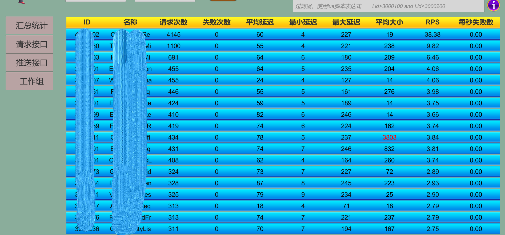
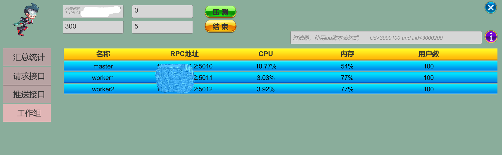

# 压力测试

&emsp;&emsp;游戏服务器开发压力测试一般用途是发现性能瓶颈点，多线程问题等。

## HTTP压测

&emsp;&emsp;游戏如果使用HTTP协议通信，则压力测试非常方便，有很多第三方工具可用，如[Locust](https://github.com/locustio/locust)
。
Locust可搭建集群，然后自己编写简单Python脚本，可模拟成千上万rps并发量。

## TCP压测

&emsp;&emsp;因为游戏很多使用自定义协议的Tcp，没有很好用的第三方工具，因此需要自行开发压力测试客户端。
在实际项目中参考locust架构搭建了一套压测集群（go）及显示工具（unity）。主要收集指标如下所示：

#### 1. 总的rps、消息平均延迟、流量、消息请求推送次数

#### 2.请求消息的请求次数、延迟、大小、rps

#### 3.推送消息的推送次数、大小、rps

#### 4.压测集群主机的CPU、内存、人数

