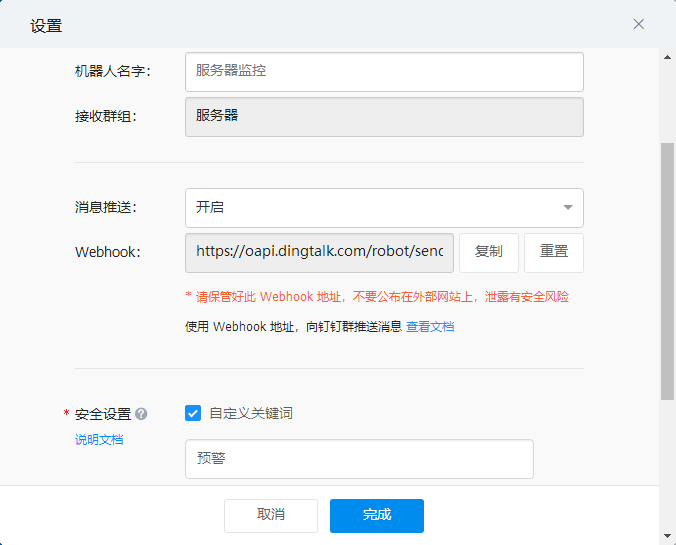

# Grafana

## 安装
1.运行docker镜像  
```shell script
docker run -d --name=grafana -p 3000:3000 grafana/grafana
```
    
2.访问地址 <http://192.168.0.1:3000/> ，账号admin 密码admin  
3.修改配置文件  
```shell script
# 1.进入docker
docker exec --user root -it a6882651c45b /bin/sh

# 2.修改默认URL地址,重启docker容器
cd config
vi defaults.ini
root_url = %(protocol)s://192.168.0.1:3000
```    
4.钉钉监控预警通知  
在钉钉群群创建Webhook如下机器人  


复制URL到Grafana设置通知渠道


注意： 预警文本需要包含钉钉设置的关键字

5.安装redis数据源插件
进入docker运行命令`grafana-cli plugins install redis-datasource`重启服务器
